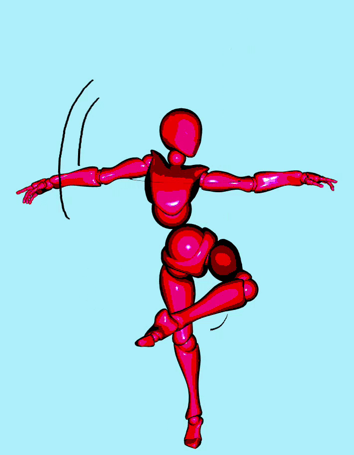
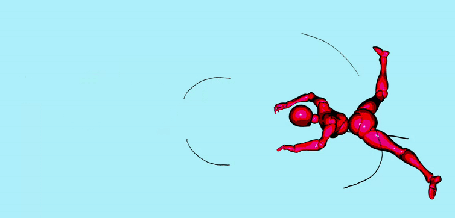
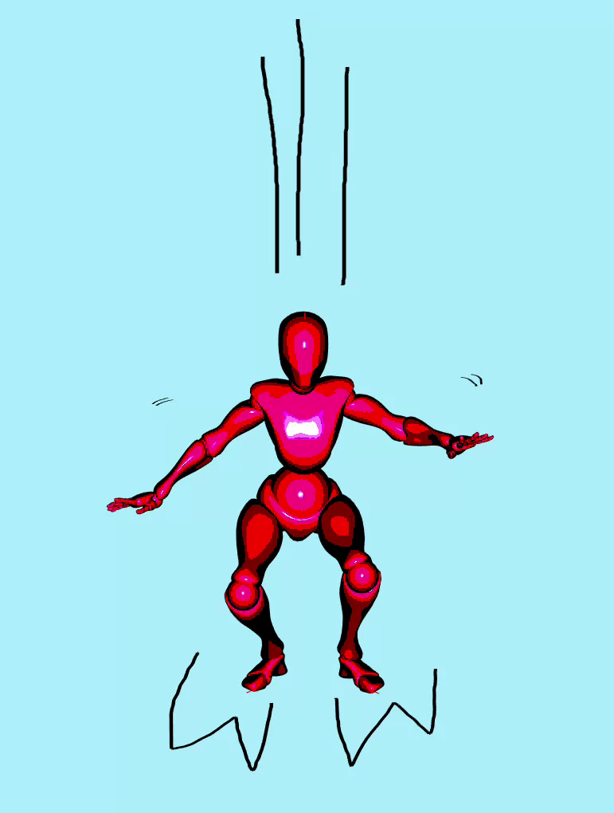

# SMACC : Sketching Motion for Articulated Characters with Comics-based annotations

We introduce SMACC, a sketch-based system for animating short sequences of 3D articulated characters inspired by 2D comic motion line annotations. SMACC relies on classical rules of motion depiction used in comic books, allowing the depiction of dynamism in static images while being universally understood. Building on this, SMACC introduces an algorithmic interpretation of these principles in the context of a 3D character animation, guided by three fundamental types of motion lines: trajectory, circumfixing and impact. The adaptation to rigged 3D characters relies on the automatic computation of how these motion cues spatially influence the character's skeleton, achieved through a global analysis of sketch annotations relative to the character's pose. The resulting animation is generated by encoding the kinematic clues and constraints into joint angular velocities. Finally, the proof-of-concept demonstrated by SMACC is validated through a user study, which evaluates the effectiveness and accuracy of this sketch-based approach applied to 3D character animation.

You can find the associated scientific paper and the example videos here : https://diglib.eg.org/items/dd175f51-df0b-40db-90a9-cdaf8b3957fd

https://www.youtube.com/watch?v=Zra3x7dnCmQ
https://www.youtube.com/watch?v=cgLmWtOyyxs

Author's website : https://perso.telecom-paristech.fr/alegrand/

## Examples




## Code

You can download the code with:
```
git clone https://github.com/imaginadine/smacc
```

## Test

To execute quickly a demonstration of SMACC:
```
./character_animation
```

## Compile

To compile with Makefile:

```
cd smacc/
make -j8

./character_animation
```

To compile with CMake:

```
cd smacc/
cmake -B build/
cd build/
make -j8

./smacc
```

More details are provided in the dedicated [Installation setup and Compilation page](https://imagecomputing.net/cgp/compilation) if needed (Windows, Linux, Mac).

## Requirements

The code requires the GLFW library in Linux and Mac, as well as the cgp library.

## CGP

CGP is a C++ library using OpenGL to represent, animate, and interact with 3D scenes. You can install it by following the instructions at this link: https://github.com/drohmer/cgp. 

You should place the cgp folder __in the same directory as the smacc folder__.

## GLFW

#### Linux (/Ubuntu)

```
sudo apt-get install libglfw3-dev
```

#### MacOS:

* You may use [brew](https://brew.sh/) to install [glfw](https://formulae.brew.sh/formula/glfw). And then add the following two lines on your .zshrc to add glfw library to the path
```
export CPATH=/opt/homebrew/include
export LIBRARY_PATH=/opt/homebrew/lib
```

* Alternatively, a pre-compiled glfw can be used without installation. To activate it, open the CMakeLists.txt file and set the option MACOS_GLFW_PRECOMPILED to ON. You may need to explicitely allow the mac to use the library if security triggers an alert.

#### Windows:

The simplest way is the use of [Visual Studio](https://visualstudio.microsoft.com/downloads/) with the __scripts/windows_cmake_visual.bat__ generating a visual studio project.

## Method

The files containing the main code of the SMACC method are located in: _/src/animated_character/motion_lines_

## Scripts

You may use the provided scripts (in directory scripts/) and configuration files to ease some of the compilation process
* _scripts/linux_compile_run_cmake.py_: Run CMake, compile and run the code on Linux and MacOS. linux_clean.py remove temporary files.
* _scripts/windows_cmake_visual.bat_: On Windows, call CMake and generate a Visual Studio project. CMake must be accessible on the command line path. scripts/windows_clean.bat remove the temporary files and the visual studio project.
